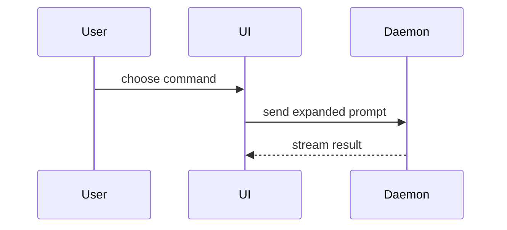

# Write PR Description

Create or update the pull request for the current branch with a description that helps the reviewer understand why the change exists and the shape of the implementation.

## Workflow

1. Read the PR template:

   `Read(.github/pull_request_template.md)`

2. Identify or create the pull request:
   - Check the current branch for an existing PR: `gh pr view --json url,number,title,state 2>/dev/null`.
   - If no PR exists, inspect `git status --short --branch` and the commits on the current branch.
   - Commit remaining changes, push the branch with an upstream, and create the PR with `gh pr create`.
   - Follow the repository's git safety protocol.

3. Gather the context needed to explain the change:
   - Read the linked issue and any relevant task artifacts.
   - Read the complete diff (`git diff main...HEAD`) and enough surrounding code to understand behavior and ownership.
   - Use `gh pr view` to collect PR metadata and changed files if the PR already exists.

4. Write the PR description following the template sections:
   - **Requirement or Bug** — one sentence or `Resolve #<number>`. Nothing more.
   - **Bug Reproduction Steps** — bug PRs only; `N/A` for features. Write `See linked issue` when steps are already there.
   - **Root Cause** — bug PRs only; `N/A` for features. State the cause and whether this is a fundamental fix or a workaround.
   - **Code Changes** — use visual outline views (see below) instead of prose whenever they explain the change better.
   - **Impact Scope** — list affected modules and test coverage.
   - **Checklist** — check every box that applies.

5. Publish the description:
   - Save to a temp file, then `gh pr edit <number> --body-file <path>` or `gh pr create --body-file <path>`.
   - Confirm the update succeeded.

## Visual Outline for Code Changes

Prefer structural views over prose. Use the smallest combination that explains the implementation. Omit categories that did not change.

Show logic or algorithm changes as pseudocode diff:

```diff
 on(save)
-  write content
+  if content is unchanged
+    return cached result
+  write new content
+  invalidate cache
```

Show runtime control flow as a call tree diff:

```diff
 submitForm
   createSession
     persistPrompt
+    expandSkillMention
     launchAgent
-  navigateToSession
+  navigateToSession
+    subscribeToEvents
```

Show file responsibility changes as a shallow file tree diff:

```diff
 src/
 ├── commands/
+│   └── show-me.ts       # expands the slash command
 ├── sessions/
-└── transport.ts
+└── transport/
+    ├── client.ts
+    └── stream.ts
```

Show component or UI structure changes as a tree diff:

```diff
 <SessionPage>
   useSessionEvents()
   <SessionToolbar>
+    <RunSkillButton />
   <SessionTimeline>
+    <SkillResultCard />
```

Show component interaction, control flow, or data flow with Mermaid (especially useful for explaining bug mechanics):



Show key data structure or type changes in a language-specific block:

```ts
interface SessionEvents {
  onTurnStart(cb: (turn: Turn) => void): void;
  onTurnEnd(cb: (turn: Turn) => void): void;
}
```

Rules for visual outlines:
- Use `diff` blocks when the point is what changes and the surrounding shape already exists.
- Show the complete target shape in a language-specific or `text` block when most of it is new or diff notation would obscure ownership or order.
- Tell the story in the order that makes it easiest to understand — files first, or data structures first, whichever fits.
- Write as one human talking to another: simple, coherent, concise language.
